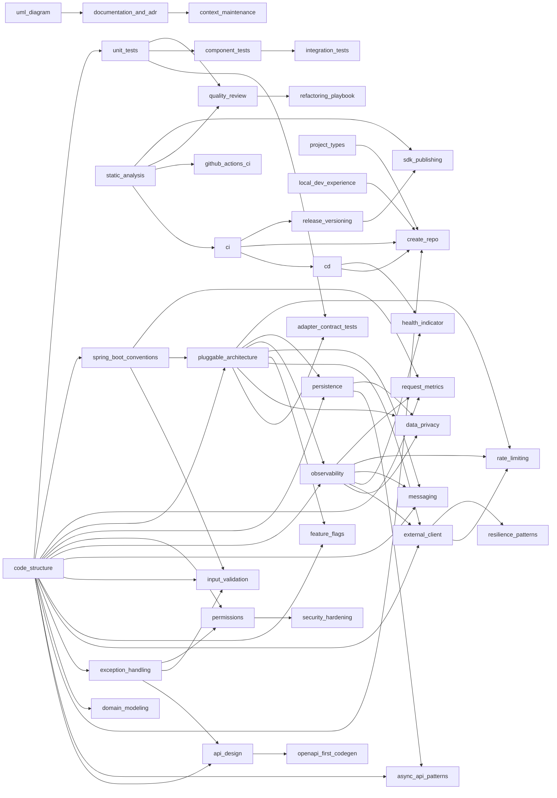

# Backend Guild — Golden Path

This is the **curated bundle** that every backend service in this
organization should follow when an agent (or a human) generates code. It
filters the 40 atomic skills in [`REGISTRY.md`](./REGISTRY.md) into a
**MUST / SHOULD / MAY** adoption matrix, an apply-order sequence, and
task-driven recipes.

> Code that does not satisfy the **MUST** column will not pass a Backend
> Guild PR review.

## 1. Adoption matrix

<!-- BEGIN AUTO:matrix -->
### MUST — every service (27)

| Skill | One-line summary |
| --- | --- |
| [`api-design`](./api-design/SKILL.md) | REST API design rules every Spring Boot service publishes — resource modelling, HTTP-verb semantics, status code catalogue, URL conventions, versioning (URI vs . |
| [`cd`](./cd/SKILL.md) | Generate a vendor-neutral Helm chart to deploy a Java/Spring Boot microservice to Kubernetes, with hardened security context, liveness/readiness probes on Actua. |
| [`ci`](./ci/SKILL.md) | Generate the Continuous Integration setup (Jenkinsfile, Dockerfile, Maven build) for a generic Java 21 / Spring Boot microservice. |
| [`code-structure`](./code-structure/SKILL.md) | Apply the canonical Java/Spring Boot package hierarchy and design patterns (Strategy + Registry, OncePerRequestFilter for metrics, Recorder pattern, Operation/S. |
| [`component-tests`](./component-tests/SKILL.md) | Generate Spring Boot component (slice) tests that boot the full application context with a dedicated test profile, replace external collaborators (HTTP clients,. |
| [`context-maintenance`](./context-maintenance/SKILL.md) | Maintain project context documentation including architecture, standards, build plans, and progress tracking. |
| [`create-repo`](./create-repo/SKILL.md) | Human-in-the-loop scaffolder that creates a brand-new Java/Spring Boot microservice repository. |
| [`data-privacy`](./data-privacy/SKILL.md) | Handle PII (Personally Identifiable Information) and GDPR requirements in a Java microservice — field-level encryption, masking in logs, data retention/TTL, rig. |
| [`documentation-and-adr`](./documentation-and-adr/SKILL.md) | Ship documentation as code — README, CONTRIBUTING, ARCHITECTURE (C4 levels 1–3 in PlantUML / Structurizr), Architecture Decision Records (ADRs) under `docs/adr/. |
| [`exception-handling`](./exception-handling/SKILL.md) | Wire a clean error contract for a Spring Boot microservice — a typed domain exception hierarchy, a static ExceptionMessages catalogue, and a @RestControllerAdvi. |
| [`external-client`](./external-client/SKILL.md) | Generate an SDK-style integration package for an external service (HTTP, gRPC, message broker, file store). |
| [`github-actions-ci`](./github-actions-ci/SKILL.md) | Alternative to the Jenkins-based `ci` skill — GitHub Actions workflows for build / test / image / release / dependency-scan. |
| [`graceful-shutdown`](./graceful-shutdown/SKILL.md) | Wire graceful shutdown into a Spring Boot service so Kubernetes pod terminations drain in-flight requests, async work, message consumers, and outbound clients w. |
| [`input-validation`](./input-validation/SKILL.md) | Implement all input validation in a Spring Boot microservice using Jakarta Bean Validation (ConstraintValidator) for field/parameter-level rules and Spring Vali. |
| [`local-dev-experience`](./local-dev-experience/SKILL.md) | Make the inner loop reproducible in under 5 minutes — docker-compose for downstream dependencies, Makefile/Justfile commands,. |
| [`observability`](./observability/SKILL.md) | Wire the three observability pillars — metrics (Micrometer + Prometheus), structured JSON logs with MDC correlation IDs, and distributed traces (OpenTelemetry) . |
| [`permissions`](./permissions/SKILL.md) | Wire authentication & authorization into a Spring Boot microservice using the Strategy + Handler pattern. |
| [`pluggable-architecture`](./pluggable-architecture/SKILL.md) | Treat every external technology integration (cache, database, metrics backend, message broker, object store, secret manager, identity provider, …) as a swappabl. |
| [`project-types`](./project-types/SKILL.md) | Meta-skill — picks the right combination of public skills for the **kind** of project being created. |
| [`quality-review`](./quality-review/SKILL.md) | Run a SOLID / clean-code / project-conventions review on a class, package, or pull request. |
| [`release-versioning`](./release-versioning/SKILL.md) | Standardize the release lifecycle — Conventional Commits, Semantic Versioning, automated CHANGELOG generation (release-please or semantic-release), git tag = ar. |
| [`request-metrics`](./request-metrics/SKILL.md) | Implement per-request domain metrics in a Spring Boot microservice using the canonical Filter + Recorder + Parser pattern. |
| [`resilience-patterns`](./resilience-patterns/SKILL.md) | Beyond simple retries — implement advanced stability patterns using Resilience4j (Bulkheads, Timeouts, Rate Limiters) and architectural strategies (Fallback, Si. |
| [`security-hardening`](./security-hardening/SKILL.md) | Cross-cutting security beyond authentication & authorization — input validation, OWASP Top 10 checklist tailored to Spring Boot, CORS, rate limiting, secret man. |
| [`spring-boot-conventions`](./spring-boot-conventions/SKILL.md) | Standard Spring Boot 3 idioms every Java microservice should adopt — typed @ConfigurationProperties over @Value, profile management, conditional beans, JSR-380 . |
| [`static-analysis`](./static-analysis/SKILL.md) | Mechanically enforce code style and catch bug classes — Spotless (formatter), SpotBugs (bug patterns), Error-Prone (compile-time bug patterns), NullAway (null-s. |
| [`unit-tests`](./unit-tests/SKILL.md) | Generate meaningful, high-coverage JUnit 5 + Mockito unit tests for Spring Boot classes. |

### SHOULD — when the service has the feature (12)

| Skill | One-line summary |
| --- | --- |
| [`adapter-contract-tests`](./adapter-contract-tests/SKILL.md) | Prove the lego-brick contract — write one shared, vendor-neutral abstract test suite (a TCK) per port interface, then run it against EVERY adapter (Redis vs Inf. |
| [`async-api-patterns`](./async-api-patterns/SKILL.md) | Handle long-running operations (> 2s) in a RESTful way. |
| [`domain-modeling`](./domain-modeling/SKILL.md) | Tactical Domain-Driven Design vocabulary every Java microservice should adopt — Bounded Context, Aggregate Root, Entity, Value Object, Domain Event, Domain Serv. |
| [`feature-flags`](./feature-flags/SKILL.md) | Implement feature toggles (flags) to decouple deployment from release. |
| [`health-indicator`](./health-indicator/SKILL.md) | Interactive (HITL) skill that adds a Spring Boot Actuator readiness HealthIndicator for a downstream dependency. |
| [`integration-tests`](./integration-tests/SKILL.md) | Drive a Spring Boot microservice against real downstream dependencies (DB, broker, S3-compatible object store, mocked HTTP) using Testcontainers, with strict Su. |
| [`messaging`](./messaging/SKILL.md) | Wire async messaging (Kafka or RabbitMQ) into a Spring Boot service with the canonical patterns — idempotent consumer, transactional outbox for producer-side at. |
| [`openapi-first-codegen`](./openapi-first-codegen/SKILL.md) | Drive controllers and DTOs from an OpenAPI 3 contract at the repo root (`api. |
| [`persistence`](./persistence/SKILL.md) | Wire the persistence layer of a Spring Boot service — Spring Data JPA repositories, JPA entities (records vs classes), Flyway migrations, transaction boundaries. |
| [`rate-limiting`](./rate-limiting/SKILL.md) | Protect the service from abuse and ensure fair usage using rate-limiting strategies. |
| [`sdk-publishing`](./sdk-publishing/SKILL.md) | Producer-side of the lego-brick principle. |
| [`uml-diagram`](./uml-diagram/SKILL.md) | Create and maintain UML diagrams using Mermaid to visualize system architecture, component relationships, and interaction flows. |

### MAY — useful but optional (1)

| Skill | One-line summary |
| --- | --- |
| [`refactoring-playbook`](./refactoring-playbook/SKILL.md) | Step-by-step migrations from common anti-patterns to the canonical patterns shipped by the other public skills — `@Value` → `@ConfigurationProperties` record, `. |

<!-- END AUTO:matrix -->

## 1b. Dependency graph (auto)

<!-- BEGIN AUTO:graph -->

<!-- END AUTO:graph -->


## 2. Adoption sequence (apply-order)

```text
project-types                            ← pick the shape
        │
        ▼
create-repo (HITL)                       ← generates skeleton, asks 16 questions
        │
        ├─► code-structure               ← packages, base classes
        ├─► spring-boot-conventions      ← config, profiles, async, scheduled
        ├─► api-design  ─►  openapi-first-codegen (optional)
        ├─► exception-handling
        ├─► permissions                  ← SPIs only; concrete resolver is org-specific
        ├─► external-client              ← one sub-package per downstream
        ├─► persistence (Flyway OR Liquibase)
        ├─► messaging                    ← if event-driven
        ├─► health-indicator (HITL, repeat per dep)
        ├─► observability
        ├─► security-hardening
        ├─► graceful-shutdown
        │
        ├─► unit-tests + component-tests + integration-tests
        ├─► static-analysis              ← build-gated
        ├─► quality-review               ← pre-PR
        │
        ├─► ci  OR  github-actions-ci    ← pick one
        ├─► cd                           ← Helm chart
        ├─► local-dev-experience
        │
        ├─► release-versioning
        ├─► documentation-and-adr  + uml-diagram
        └─► context-maintenance          ← every time architecture moves
```

## 3. Task-driven agent recipes

Each recipe lists **only** the skills that materially constrain the change.
An agent should read the listed skills (in order) before producing a diff.

### 3.1 New repository

`project-types` → `create-repo` → (all MUST) → optional SHOULD skills the
shape demands.

### 3.2 New HTTP endpoint

`api-design` (incl. §6b for multipart) → `openapi-first-codegen` (if used)
→ `code-structure` → `permissions` → `exception-handling` → `unit-tests` +
`component-tests`.

### 3.3 New outbound dependency

`external-client` → `health-indicator` (HITL) → `observability` →
`integration-tests` (if it has real semantics) → `security-hardening` (auth
/ secrets).

### 3.4 New entity / schema change

`persistence` (right migration tool) → `domain-modeling` (if aggregate
boundaries change) → `integration-tests` → migration test on empty DB.

### 3.5 New Kafka consumer

`messaging` → `code-structure` (consumer sub-package) → `observability`
(consumer lag SLI) → `integration-tests` (Testcontainers Kafka) →
`graceful-shutdown` (consumer drain).

### 3.6 New scheduled job

`spring-boot-conventions` §7b → `observability` (`scheduled.task.duration`
timer) → `unit-tests` (idempotency test) → `graceful-shutdown` (interrupt-
aware sleep).

### 3.7 Refactor / pay down debt

`refactoring-playbook` → `quality-review` → re-run `unit-tests` +
`static-analysis` and verify mutation score did not regress.

### 3.8 Pre-PR check (every change)

`quality-review` checklist + `bash validate-skills.sh` if
`public/skills/` was touched + ensure `static-analysis` build passes locally.

### 3.9 New external technology integration (cache, DB dialect, metrics backend, broker, …)

`pluggable-architecture` (define the `spi/` port → `adapter/<vendor>/`
implementations → config-driven selection with a `@ConditionalOnMissingBean`
default) → `adapter-contract-tests` (one TCK per port, every adapter passes
it) → `observability` (per-provider metrics/logs) → `integration-tests`
(Testcontainers for real-backend adapters). Confirm a provider swap needs
**only** a property change.

### 3.10 New validation rule

`input-validation` (decide Jakarta `@Constraint` vs Spring `Validator` →
create rule bean in `rule/` → create validator in `validator/` → register in
`ValidationConfig` or add `@Validated` to controller) → `unit-tests` (rule
bean in isolation, validator with mocked `ConstraintValidatorContext`) →
`component-tests` (end-to-end 400 `ProblemDetail` path).

### 3.11 New downstream microservice integration

`external-client` (create `client/<dep>/` with `*Service` → `*CoreService` →
`*Client` + `handler/request/` + `handler/response/` + `constant/`) →
`exception-handling` (domain exception for non-2xx) → `health-indicator`
(readiness probe for the new dependency) → `resilience-patterns` (circuit
breaker + retry) → `request-metrics` (add a recorder if the call is an
endpoint the team wants to meter) → `unit-tests` (every layer) →
`integration-tests` (WireMock against the real HTTP boundary).

### 3.12 New domain endpoint metric

`request-metrics` (add `METRIC_<NAME>` constant → URI pattern in
`MonitoringConfig` → `<UseCase>MetricsRecorder` → any new `<Concept>Parser`
if a new tag is needed) → `unit-tests` (recorder + parser) → `observability`
(alert rule / dashboard panel if SLO is involved).

## 4. Guild non-negotiables (24)

These are the rules the guild enforces during PR review. Every agent
producing code must validate the diff against this list before returning.

1. **Package layout** matches `code-structure` exactly.
2. **Config** is `@ConfigurationProperties` (record), never `@Value` for
   grouped properties (`spring-boot-conventions` §1).
3. **Controllers contain no business logic**; they call a `*Service` or a
   `*Operation` (`code-structure`).
4. **Exceptions** extend the project hierarchy and carry an
   `ExceptionMessages` code (`exception-handling`).
5. **Authorization** goes through `PermissionsHandler`, never inline
   `if (principal.isAdmin)` (`permissions`).
6. **Outbound HTTP** goes through an `*Client` in its own sub-package —
   never raw `WebClient` / `RestClient` calls in a service
   (`external-client`).
7. **Transactions** live in the service layer, `readOnly = true` for
   queries (`persistence` §4).
8. **`@Async` and `@Scheduled`** use a named `TaskExecutor` and a property-
   driven interval respectively (`spring-boot-conventions` §7, §7b).
9. **Caching** declares the provider, name, key, and TTL explicitly
   (`spring-boot-conventions` §8).
10. **Messaging consumers** are idempotent and have a DLQ wired
    (`messaging`).
11. **Logs** are JSON with MDC correlation IDs; no `e.printStackTrace()`
    (`observability`).
12. **Tests**: PIT mutation score ≥ 75 %; no `@MockBean` on the class
    under test; right-boundary mocking (`unit-tests`, `quality-review`).
13. **Static analysis** is non-skippable in the Maven build
    (`static-analysis`).
14. **Generated sources** under `target/generated-sources/**` are excluded
    from coverage, Spotless, SpotBugs, NullAway, ArchUnit
    (`openapi-first-codegen`).
15. **URL conventions**: plural nouns, kebab-case, version in path,
    `application/problem+json` for errors (`api-design`).
16. **Secrets** never appear in `application.yaml` or in commit history
    (`security-hardening`).
17. **Graceful shutdown** is enabled and exercised by a component test
    (`graceful-shutdown`).
18. **Releases** use Conventional Commits; CHANGELOG is automated
    (`release-versioning`).
19. **`context/` documentation** is updated in the same PR as the code
    change it describes (`context-maintenance`).
20. **External technology is behind a port.** Any integration with an
    external tool (cache, DB dialect, metrics backend, broker, object
    store, secret manager, identity provider, …) is consumed through a
    project-owned `spi/` port; the vendor SDK is imported **only** inside
    `adapter/<vendor>/`; selection/composition is config-driven in
    `config/` with a `@ConditionalOnMissingBean` safe default. No vendor
    type leaks into `spi/`, `service/`, `operation/`, or `controller/`
    (`pluggable-architecture`, ArchUnit-enforced).
21. **Every adapter passes the shared port TCK.** Each port has one
    abstract contract test; every adapter (including the composite)
    subclasses it and passes identical assertions, and a build check fails
    when an `*Adapter` has no matching `*ContractTest`
    (`adapter-contract-tests`).
22. **Input validation lives in the validation layer — never inline.**
    Parameter/field rules use Jakarta `@Constraint` + `ConstraintValidator`;
    object/cross-field rules use Spring `Validator` + `@InitBinder`.
    Domain rule logic is extracted into `rule/` beans. The controller class
    carries `@Validated`; never write `if (x == null) throw new
    BadRequestException(...)` in a controller, operation, or service
    (`input-validation`).
23. **Every external downstream is wrapped in a `client/<dep>/` sub-package.**
    Callers depend only on `*Service`; `WebClient`, `Mono`, `Flux`, and remote
    DTOs never escape the package. `exchangeToMono` + `handleResponse` handles
    all non-2xx. Filter map, request building, response parsing, and boolean
    response checks each live in their own dedicated class
    (`external-client`).
24. **Domain endpoint metrics use the Filter → Recorder → Parser pattern.**
    `MetricsFilter` measures every request in `try/finally`; `MonitoringConfig`
    maps URI regexes to metric names; `MetricsRecorderRegistry` routes to a
    `MetricsRecorder`; parsers extract tags. A new metric = one new recorder +
    one `MonitoringConfig` entry. Parsers never return `null` or blank
    (`request-metrics`).

## 5. Pre-flight checklist — first PR of a new service

- [ ] `mvn -q verify` passes locally and in CI.
- [ ] Mutation score ≥ 75 % on the touched packages.
- [ ] Liveness + readiness probes return 200 against a real run.
- [ ] Docker image runs as **non-root** and starts on a clean machine.
- [ ] Helm chart `helm lint` clean.
- [ ] `README.md` answers: what does it do, how do I run it, how do I
      observe it, who owns it.
- [ ] ADR-0001 (initial architecture) merged under `docs/adr/`.
- [ ] `context/` folder populated; `context-maintenance` skill applied.
- [ ] `bash validate-skills.sh` clean (if you touched `public/skills/`).

## 6. Change-control for this document

This file is a contract between the guild and code-generating agents.
Loosening any of the **24 non-negotiables** requires:

1. An ADR proposing the change under `docs/adr/`.
2. Approval from the architect group responsible for the catalogue.
3. A matching update to [`REGISTRY.md`](./REGISTRY.md) and the affected
   `SKILL.md`.
4. `bash validate-skills.sh` passing on the same PR.
5. A guild vote when the change weakens an enforcement (e.g. lowering the
   mutation-score threshold).

