# UML Diagram Skill (Mermaid)

Create and maintain Mermaid diagrams to visualize system architecture, components, and interactions. Mermaid diagrams render natively on GitHub, GitLab, and many modern documentation platforms - no external tools needed!

## Why Mermaid?

### Advantages ✅
- **Native Rendering**: GitHub, GitLab, Azure DevOps all render Mermaid directly
- **No Build Step**: No need to generate images - diagrams render from markdown
- **Easy Editing**: Edit directly on GitHub web interface
- **Version Control**: Just markdown text, perfect for git
- **Live Preview**: Most IDEs support Mermaid preview
- **Simpler**: Easier syntax than PlantUML
- **Modern**: Active development, growing ecosystem

### vs PlantUML
PlantUML is more feature-rich but requires:
- Java installation
- External tool to generate images
- Committing generated images to git
- Regenerating on every change

**Verdict**: Mermaid is better for modern GitHub-based projects.

## When to Use

Apply this skill when:
- ✅ Documenting new system architecture
- ✅ Explaining component relationships
- ✅ Visualizing sequence flows
- ✅ Creating technical documentation
- ✅ Onboarding new team members
- ✅ Reviewing system design
- ✅ Planning architecture changes

## Diagram Types

## Diagram Types

### 1. System Context / Architecture Diagrams

#### System Context Diagram
**Purpose**: Show the system in its environment with external dependencies

**Template**:
````markdown
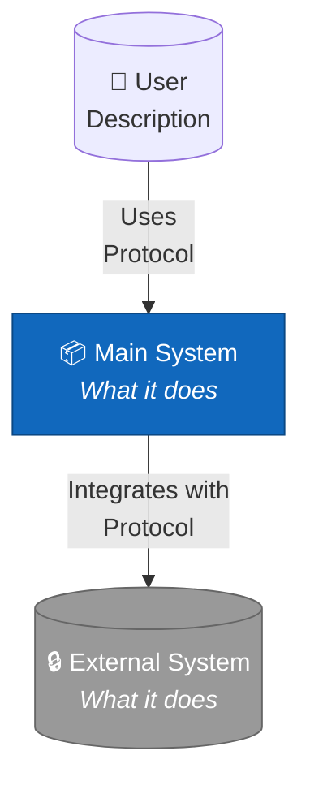
````

**When to Create**: At project start, or when external dependencies change

**Example**: See [`context/system-context.md`](../../../context/system-context.md)

#### Component/Container Diagram
**Purpose**: Show high-level technology choices and component interactions

**Template**:
````markdown
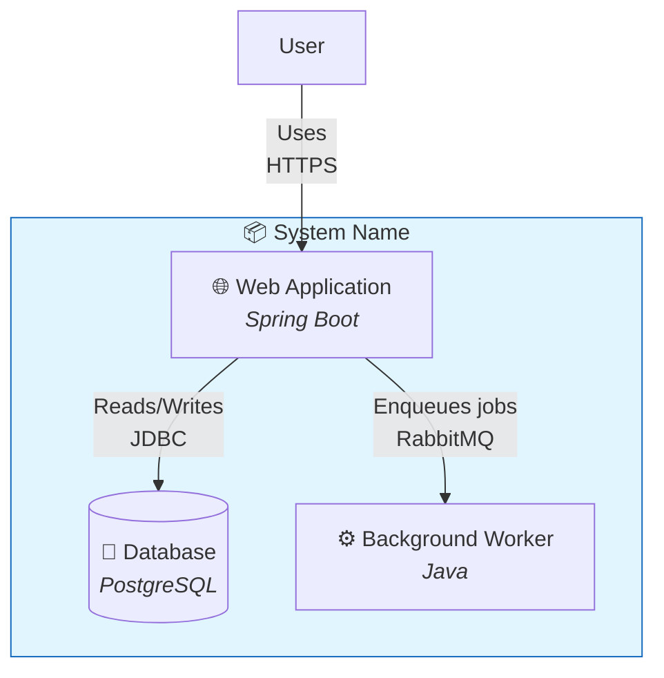
````

**Example**: See [`context/component-diagram.md`](../../../context/component-diagram.md)

### 2. Sequence Diagrams

**Purpose**: Show interactions over time between components

**Template**:
````markdown
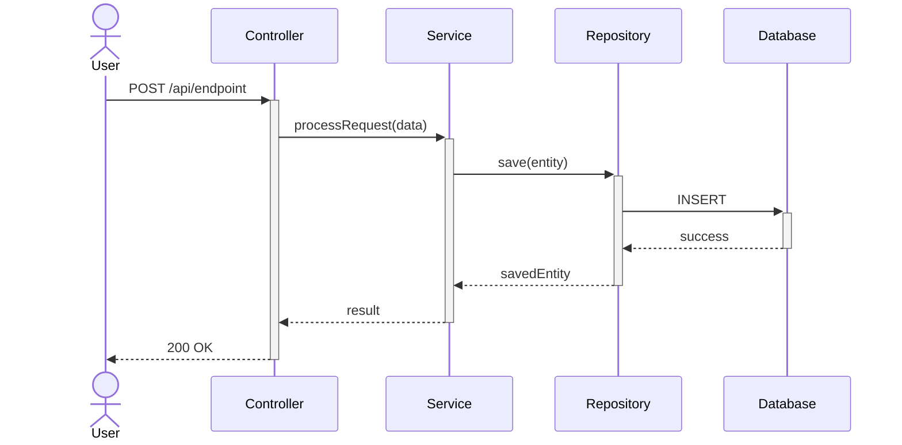
````

**Common Patterns**:

**Error Handling**:
````markdown
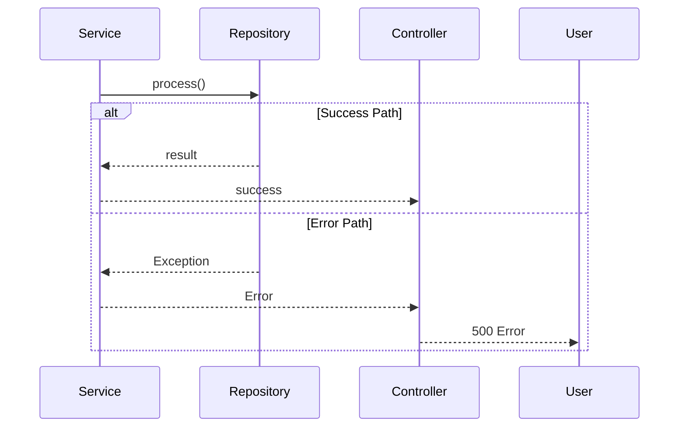
````

**Async Processing**:
````markdown
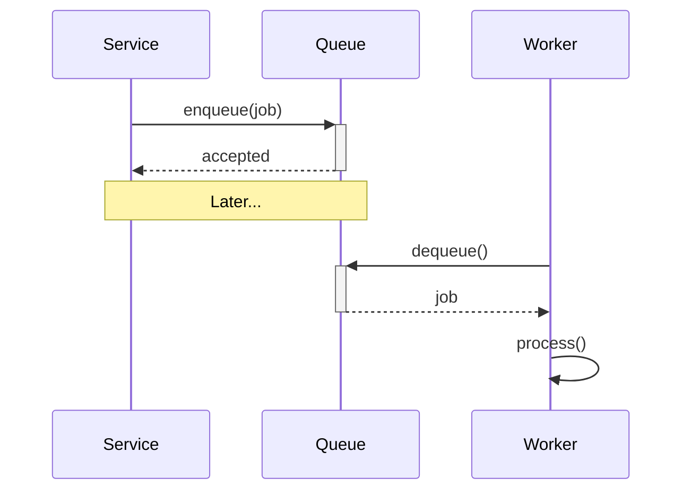
````

**Loops**:
````markdown
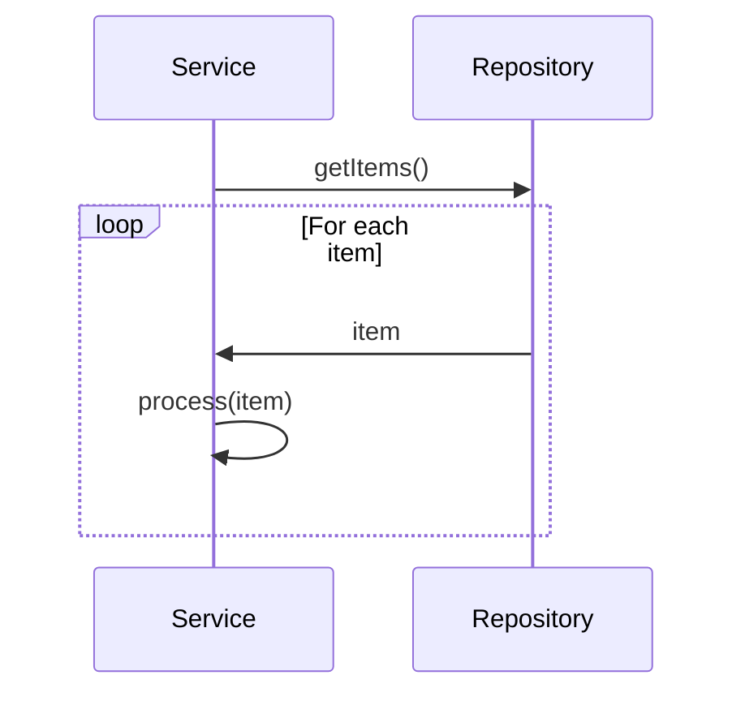
````

**Example**: See [`context/domain-flow.md`](../../../context/domain-flow.md)

### 3. Class Diagrams

**Purpose**: Show class structure and relationships

**Template**:
````markdown
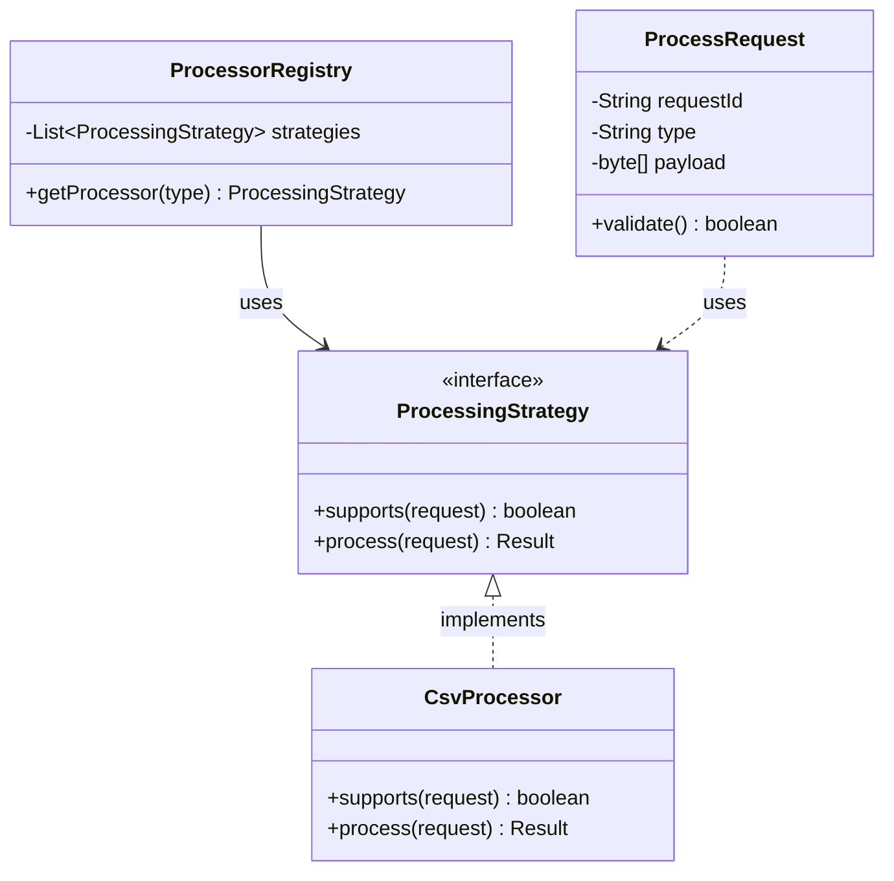
````

**Relationship Types**:
- `<|--` : Inheritance
- `*--` : Composition
- `o--` : Aggregation
- `-->` : Association
- `..|>` : Realization/Implementation
- `..>` : Dependency

### 4. State Diagrams

**Purpose**: Show state transitions

**Template**:
````markdown
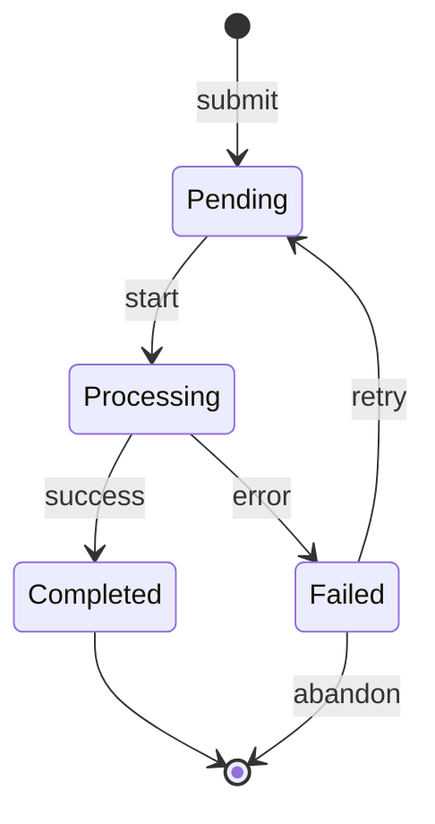
````

### 5. Entity Relationship Diagrams (ERD)

**Purpose**: Database schema visualization

**Template**:
````markdown
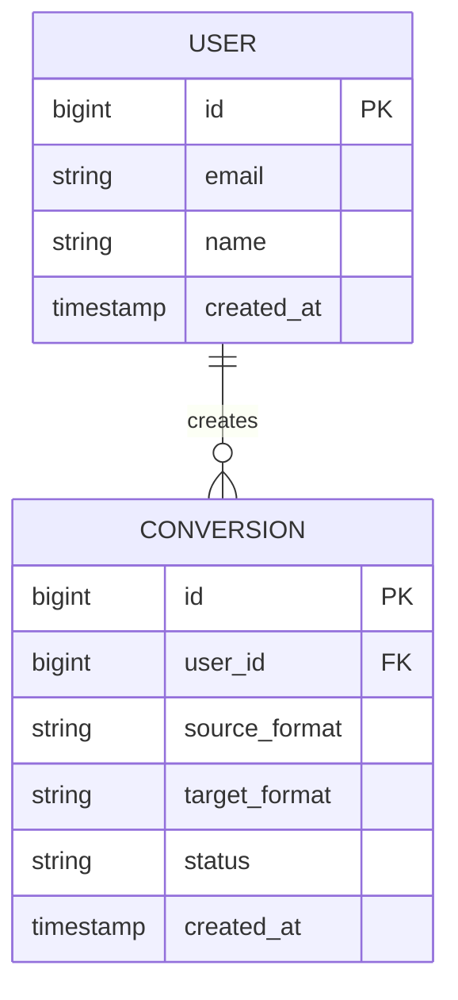
````

### 6. Flowcharts

**Purpose**: Process flows and decision trees

**Template**:
````markdown
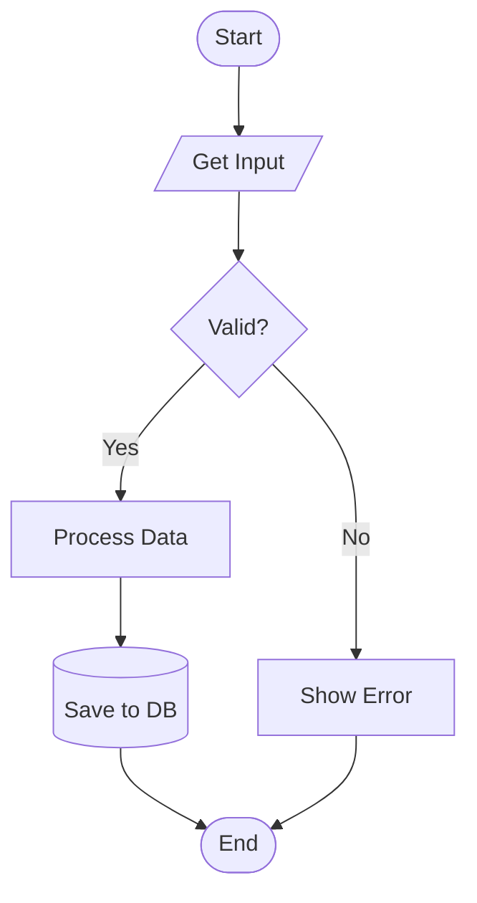
````

### 7. Gantt Charts

**Purpose**: Project timelines and schedules

**Template**:
````markdown
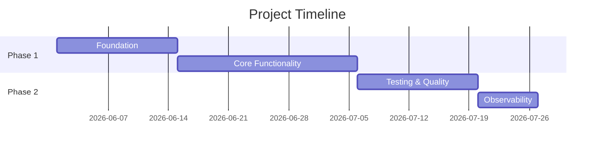
````

## Mermaid Setup

### No Installation Required! 🎉

Mermaid renders automatically on:
- ✅ **GitHub** - Native support in markdown files
- ✅ **GitLab** - Native support in markdown files
- ✅ **Azure DevOps** - Native support
- ✅ **Notion** - Supports Mermaid blocks
- ✅ **Confluence** - Via Mermaid plugin
- ✅ **VS Code** - Via extensions
- ✅ **IntelliJ IDEA** - Via plugins

### IDE Integration

**VS Code**:
1. Install "Markdown Preview Mermaid Support" extension
2. Or install "Mermaid Editor" for dedicated view
3. Open any `.md` file with Mermaid diagram
4. Press `Ctrl+Shift+V` (Cmd+Shift+V on Mac) to preview

**IntelliJ IDEA**:
1. Install "Mermaid" plugin from marketplace
2. Open `.md` file → preview shows automatically
3. Or use built-in markdown preview (supports Mermaid natively in newer versions)

**Eclipse**:
1. Install "Markdown Editor" with Mermaid support
2. Open `.md` file → preview renders Mermaid

### Online Editors

- **Mermaid Live Editor**: https://mermaid.live/
- **Draw.io**: Supports Mermaid import
- **GitHub**: Edit directly in web interface and preview

### CLI Tool (Optional)

If you need to generate static images:

```bash
# Install globally
npm install -g @mermaid-js/mermaid-cli

# Generate PNG
mmdc -i diagram.md -o diagram.png

# Generate SVG
mmdc -i diagram.md -o diagram.svg

# Generate PDF
mmdc -i diagram.md -o diagram.pdf
```

But usually **not needed** - just commit the `.md` files!

## Best Practices

### 1. Keep Diagrams Simple
- One concept per diagram
- Max 7-10 components per diagram
- Split complex systems into multiple diagrams

### 2. Use Consistent Naming
- Match code class/component names
- Use descriptive names
- Follow naming conventions from code

### 3. Layer Your Diagrams
- **Level 1**: System Context (external view)
- **Level 2**: Container (high-level tech)
- **Level 3**: Component (detailed structure)
- **Level 4**: Code (class diagrams)

### 4. Keep Updated
- Update diagrams when code changes
- Review diagrams during code reviews
- Include diagram updates in PR checklist

### 5. Version Control
- Store `.md` files in git (native rendering)
- No need to commit generated images (reduces repo size/noise)
- Keep diagrams close to code they document

## Common Patterns

### Strategy Pattern Visualization

````markdown
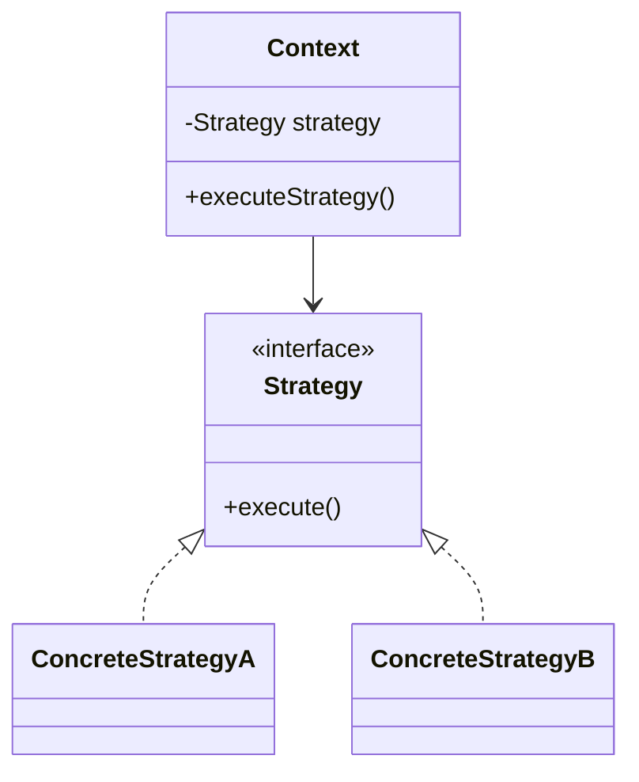
````

### Event-Driven Architecture

````markdown
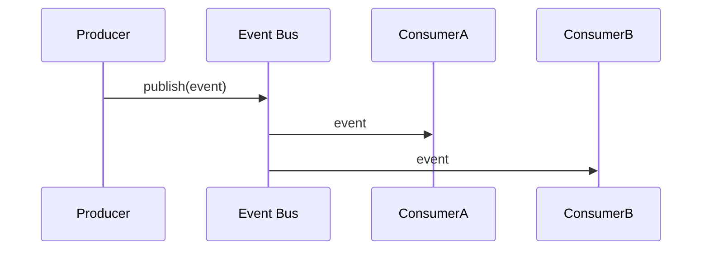
````

### Repository Pattern

````markdown
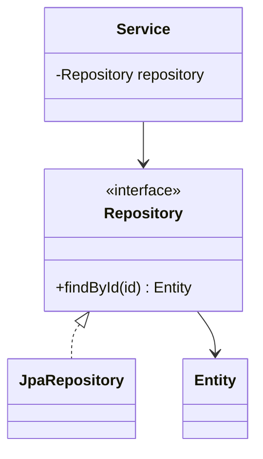
````

## Styling and Theming

Mermaid supports styling individual nodes and overall themes.

### Themes
You can set themes at the top of the mermaid block:
````markdown
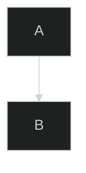
````
Available themes: `default`, `forest`, `dark`, `neutral`, `base`.

### Custom Node Styling
````markdown
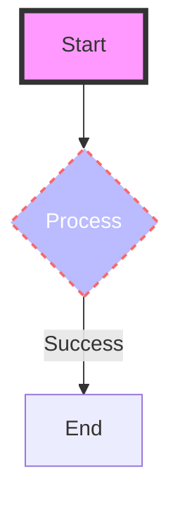
````

## Documentation Integration

### In README.md

````markdown
## Architecture

See our architecture diagrams:

- [System Context](context/system-context.md)
- [Component Diagram](context/component-diagram.md)

Diagrams are rendered natively in the browser on GitHub.
````

### In ADRs

````markdown
# ADR-001: Use Event-Driven Architecture

## Decision
We will use event-driven architecture.

## Interaction Flow
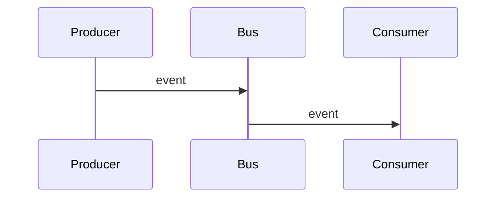
````

### In Context Documentation

Simply wrap the Mermaid code in a fenced code block with the `mermaid` language identifier.

## Validation

### Syntax Check

The best way to validate is:
1. **IDE Preview**: Most markdown plugins show errors if syntax is invalid.
2. **Mermaid Live Editor**: Paste your code into https://mermaid.live/ to verify.
3. **CLI**: Use `mmdc` to verify it compiles to image if needed.

### CI/CD Integration

You can use the Mermaid CLI in your pipeline to validate syntax:

**GitHub Actions**:
```yaml
- name: Validate Mermaid Syntax
  run: |
    npm install -g @mermaid-js/mermaid-cli
    for f in context/*.md; do
      mmdc -i "$f" -o /dev/null || exit 1
    done
```

## Troubleshooting

### Common Issues

**Issue**: Diagram doesn't render on GitHub
**Solution**: Ensure you used the ` ```mermaid ` identifier and closed it with ` ``` `. Also ensure it's in a `.md` file.

**Issue**: "Max levels exceeded"
**Solution**: Your diagram is too complex. Try splitting it into smaller sub-graphs or separate diagrams.

**Issue**: Sequence diagram arrows looking weird
**Solution**: Check the arrow syntax (`->>` for solid, `-->>` for dashed). Avoid mixing them if not intended.

## Examples

### Example 1: Main Domain Flow
See: [`context/domain-flow.md`](../../../context/domain-flow.md)

### Example 2: System Context
See: [`context/system-context.md`](../../../context/system-context.md)

### Example 3: Component Structure
See: [`context/component-diagram.md`](../../../context/component-diagram.md)

## Resources

- **Mermaid Official**: https://mermaid.js.org/
- **Mermaid Live Editor**: https://mermaid.live/
- **C4 with Mermaid**: https://mermaid.js.org/syntax/c4c.html
- **Mermaid Cheat Sheet**: https://mermaid.js.org/syntax/flowchart.html

## Related Skills

- [context-maintenance](../context-maintenance/SKILL.md) - Maintain context docs
- [documentation-and-adr](../documentation-and-adr/SKILL.md) - General documentation
- [architecture](../api-design/SKILL.md) - API design documentation

